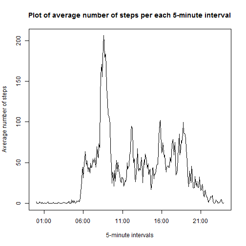
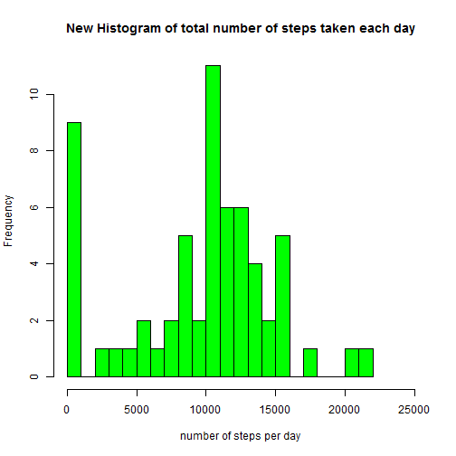
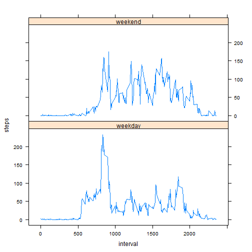

## Loading and preprocessing the data

Let's first download and unzip the data for the project


```r
if (!file.exists("./activity.txt")) {
  fileUrl <- "http://d396qusza40orc.cloudfront.net/repdata%2Fdata%2Factivity.zip"
  download.file(fileUrl, dest = "activity.zip", mode = "wb")
  unzip ("activity.zip", exdir = ".")
}
```

Now load the data


```r
activity <- read.csv("activity.csv")
```

Let us transform the data into a format suitable for the analysis.
Transform date variable in the Date format


```r
activity$date <- as.Date(activity$date)
```

Transform interval variable in the Time format (POSIXlt). First we will record interval in the form hh:mm

```r
activity$interval <- sprintf("%04d", activity$interval)
int1 <- substr(activity$interval, start = 1, stop = 2)
int2 <- substr(activity$interval, start = 3, stop = 4)
int <- paste(int1,int2,sep = ":")
head(int)
```

```
## [1] "00:00" "00:05" "00:10" "00:15" "00:20" "00:25"
```

```r
activity$interval <- int
```


## What is mean total number of steps taken per day?

To count the total number of steps taken per day we'll use the dplyr package. First provide such pipeline operations as groupping by date and summarizing by date.


```r
library(dplyr)
```

```
## 
## Attaching package: 'dplyr'
## 
## The following object is masked from 'package:stats':
## 
##     filter
## 
## The following objects are masked from 'package:base':
## 
##     intersect, setdiff, setequal, union
```


```r
a <- activity %>% group_by(date) %>% summarize(steps = sum(steps, na.rm = TRUE))
a
```

```
## Source: local data frame [61 x 2]
## 
##          date steps
## 1  2012-10-01     0
## 2  2012-10-02   126
## 3  2012-10-03 11352
## 4  2012-10-04 12116
## 5  2012-10-05 13294
## 6  2012-10-06 15420
## 7  2012-10-07 11015
## 8  2012-10-08     0
## 9  2012-10-09 12811
## 10 2012-10-10  9900
## ..        ...   ...
```

Then make a histogram of the total number of steps taken each day:


```r
hist(a$steps, col = "red", main = "Histogram of total number of steps taken each day", xlab = "number of steps per day", breaks = 20, xlim = c(0,25000))
```

 

Now calculate the mean and median of the total number of steps taken per day


```r
mean <- mean(a$steps)
mean1 <- round(mean(a$steps), digits = 2)
median <- median(a$steps)
```
 So the mean of the total number of steps taken per day equils approximately 9354.23 and the median equils 10395.

## What is the average daily activity pattern?

First find the average value of number of steps per 5-minute intervals.


```r
library(dplyr)
i <- activity %>% group_by(interval) %>% summarize(steps = mean(steps, na.rm = TRUE))
i
```

```
## Source: local data frame [288 x 2]
## 
##    interval     steps
## 1     00:00 1.7169811
## 2     00:05 0.3396226
## 3     00:10 0.1320755
## 4     00:15 0.1509434
## 5     00:20 0.0754717
## 6     00:25 2.0943396
## 7     00:30 0.5283019
## 8     00:35 0.8679245
## 9     00:40 0.0000000
## 10    00:45 1.4716981
## ..      ...       ...
```

Then convert interval into time object:

```r
i$interval <- strptime(i$interval, "%H:%M")
```


Now plot number of steps taken, averaged across all days for every the 5-minute intervals


```r
plot(i$interval, i$steps, type = "l", main = "Plot of average number of steps per each 5-minute interval", xlab = "5-minute intervals", ylab = "Average number of steps")
```

 

Calculate which 5-minute interval, on average across all the days in the dataset, contains the maximum number of steps:


```r
  max <- i$steps[1]
  maxint <- i$interval[1]
  for (j in 1:length(i$steps)){
    if (i$steps[j] > max) {
      max <- i$steps[j]
      maxint <- i$interval[j]
    }
  }
  rez <- paste(maxint$hour, maxint$min, sep=":")
```

The maximum number of steps usually is taken in the interval 8:35.

## Imputing missing values

The total number of missing values in the dataset


```r
sum(!complete.cases(activity))
```

```
## [1] 2304
```

We will impute missing data points using the average value per this 5-minute interval. 


```r
activityfull <- read.csv("activity.csv")
for (j in 1:length(activityfull$steps)){
  if (is.na(activityfull$steps[j])){
    activityfull$steps[j] <- i$steps[j]
  }
}
```

Now we are going to make a histogram of the total number of steps taken each day.

For this purpose let us first transform date variable in the Date format


```r
activityfull$date <- as.Date(activityfull$date)
```


count the total number of steps taken per day 


```r
library(dplyr)
```


```r
afull <- activityfull %>% group_by(date) %>% summarize(steps = sum(steps, na.rm = TRUE))
afull
```

```
## Source: local data frame [61 x 2]
## 
##          date    steps
## 1  2012-10-01 10766.19
## 2  2012-10-02   126.00
## 3  2012-10-03 11352.00
## 4  2012-10-04 12116.00
## 5  2012-10-05 13294.00
## 6  2012-10-06 15420.00
## 7  2012-10-07 11015.00
## 8  2012-10-08     0.00
## 9  2012-10-09 12811.00
## 10 2012-10-10  9900.00
## ..        ...      ...
```

Make a histogram of the total number of steps taken each day:


```r
hist(afull$steps, col = "green", main = "New Histogram of total number of steps taken each day", xlab = "number of steps per day", breaks = 20, xlim = c(0,25000))
```

 

Now calculate the mean and median of the total number of steps taken per day


```r
meanfull <- mean(afull$steps)
mean1full <- round(mean(afull$steps), digits = 2)
medianfull <- median(afull$steps)
```
 So the mean of the total number of steps taken per day in the new dataset equils approximately 9530.72 and the median equils 1.0439 &times; 10<sup>4</sup>.
 
 How much these values differ from the estimates from the first part of the assignment?
 

```r
meandif <- mean - meanfull
mediandif <- median - medianfull
```

So, the difference between mean values is -176.4948964 and the difference between median values is -44. Thus we may say that the impact of imputing missing data on the estimates of the total daily number of steps is insignificant.


## Are there differences in activity patterns between weekdays and weekends?

First create a new factor variable in the dataset with two levels - "weekday" and "weekend" indicating whether a given date is a weekday or weekend day


```r
activityfull <- mutate(activityfull, weekd = weekdays(date))
for (j in 1:nrow(activityfull)){
if (activityfull$weekd[j] %in%
      c("Monday", "Tuesday", "Wednesday", "Thursday", "Friday")) {
  activityfull$weekd[j] <- "weekday"
}
else {
  activityfull$weekd[j] <- "weekend"
}
}
activityfull$weekd <- as.factor(activityfull$weekd)
```

Now make a panel plot containing a time series plot (i.e. type = "l") of the 5-minute interval (x-axis) and the average number of steps taken, averaged across all weekday days or weekend days (y-axis).


```r
activityfull <- activityfull %>% group_by(interval, weekd) %>% summarize(steps = mean(steps, na.rm = TRUE))

library(lattice)
xyplot(steps ~ interval | weekd, data = activityfull, type = "l", layout = c(1,2))
```

 
