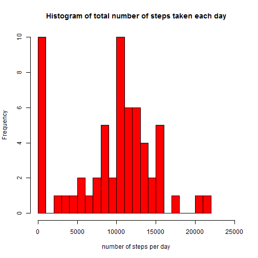

## Loading and preprocessing the data

Let's first download the data for the project


```r
if (!file.exists("./pml-training.csv")) {
  fileUrl <- "http://d396qusza40orc.cloudfront.net/predmachlearn/pml-training.csv"
  download.file(fileUrl, dest = "pml-training.csv", mode = "wb")
  }
if (!file.exists("./pml-testing.csv")) {
  fileUrl <- "http://d396qusza40orc.cloudfront.net/predmachlearn/pml-testing.csv"
  download.file(fileUrl, dest = "pml-testing.csv", mode = "wb")
  }
```

Now load the data


```r
training <- read.csv("pml-training.csv")
testing <- read.csv("pml-testing.csv")
```

Let us separate the training data set into 2 subset train0, test0


```r
library(caret)
```

```
## Warning: package 'caret' was built under R version 3.1.3
```

```
## Loading required package: lattice
## Loading required package: ggplot2
```

```
## Warning: package 'ggplot2' was built under R version 3.1.3
```

```r
inTrain <- createDataPartition(y = training$classe, p = 0.7, list = F)
train0 <- training[inTrain, ]
test0 <- training[-inTrain, ]
```


Plot total acceleration for the subject Carlitos

```r
train1 <- transform(train0, classe = factor(classe))
sub1 <- subset(train1, user_name == "carlitos")
plot(sub1[,63], col= sub1$classe)
```

 

Try to use featurePlot to figure out some useful characteristics of variables:

```r
library(ggplot2)
featurePlot(x = train0[,c("total_accel_arm","total_accel_dumbbell","total_accel_forearm")], y = train0$classe, plots = "pairs")
```

 

We see clear separation by index, but nothing to single out the unique class.

I made a huge amount of the featurePlots but didn't identify any feature that is clearly separate classes.

Try to built prediction with linear discriminant analysis as it turned out that this method and the best method for the given problem do not differ much in accuracy. We will take that features that have not "NA" values in the testing set, that will be 51 variables 

```r
modlda <- train(classe ~ roll_belt+pitch_belt+yaw_belt+total_accel_belt+gyros_belt_x+gyros_belt_y+gyros_belt_z+accel_belt_x+accel_belt_y+accel_belt_z+magnet_belt_x+magnet_belt_y+magnet_belt_z+roll_arm+pitch_arm+yaw_arm+total_accel_arm+gyros_arm_x+gyros_arm_y+gyros_arm_z+accel_arm_x+accel_arm_y+accel_arm_z+magnet_arm_x+magnet_arm_y+magnet_arm_z+roll_dumbbell+pitch_dumbbell+yaw_dumbbell+total_accel_dumbbell+gyros_dumbbell_x+gyros_dumbbell_y+gyros_dumbbell_z+accel_dumbbell_x+accel_dumbbell_y+accel_dumbbell_z+magnet_dumbbell_x+magnet_dumbbell_y+magnet_dumbbell_z+roll_forearm+pitch_forearm+yaw_forearm+gyros_forearm_x+gyros_forearm_y+gyros_forearm_z+accel_forearm_x+accel_forearm_y+accel_forearm_z+magnet_forearm_x+magnet_forearm_y+magnet_forearm_z, method="lda", data = train0)
```

```
## Loading required package: MASS
```

```r
print(modlda)
```

```
## Linear Discriminant Analysis 
## 
## 13737 samples
##   159 predictor
##     5 classes: 'A', 'B', 'C', 'D', 'E' 
## 
## No pre-processing
## Resampling: Bootstrapped (25 reps) 
## 
## Summary of sample sizes: 13737, 13737, 13737, 13737, 13737, 13737, ... 
## 
## Resampling results
## 
##   Accuracy   Kappa     Accuracy SD  Kappa SD   
##   0.6992397  0.619051  0.006814974  0.008558757
## 
## 
```

Now compare the predicted values with true values:

```r
pred <-predict(modlda, test0)
plot(pred, unclass(test0$classe), data = test0)
```

 

```r
table(pred, test0$classe)
```

```
##     
## pred    A    B    C    D    E
##    A 1375  174  116   65   56
##    B   46  720   97   33  190
##    C  101  142  678  124  107
##    D  143   38  105  709  114
##    E    9   65   30   33  615
```


library(knitr)
knit2html("PA1_template.Rmd")
browseURL("PA1_template.html")
